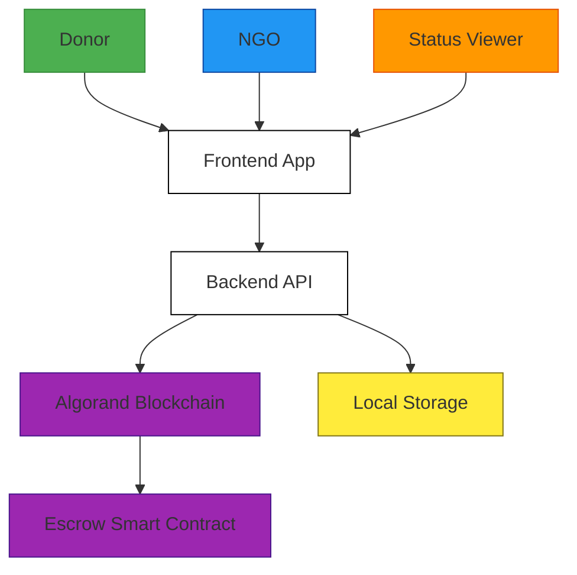

```mermaid
graph TD
    A[Donor] --> B[Frontend App]
    C[NGO] --> B
    D[Status Viewer] --> B
    B --> E[Backend API]
    E --> F[Algorand Blockchain]
    E --> G[Local Storage]
    F --> H[Escrow Smart Contract]
    
    style A fill:#4CAF50,stroke:#388E3C
    style C fill:#2196F3,stroke:#0D47A1
    style D fill:#FF9800,stroke:#E65100
    style B fill:#FFFFFF,stroke:#000000
    style E fill:#FFFFFF,stroke:#000000
    style F fill:#9C27B0,stroke:#4A148C
    style G fill:#FFEB3B,stroke:#827717
    style H fill:#9C27B0,stroke:#4A148C
```